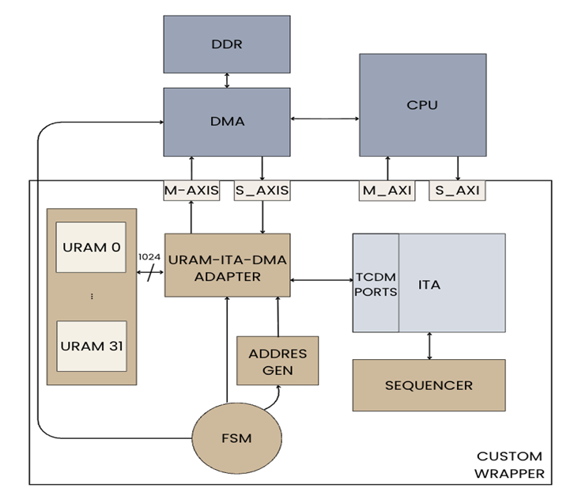
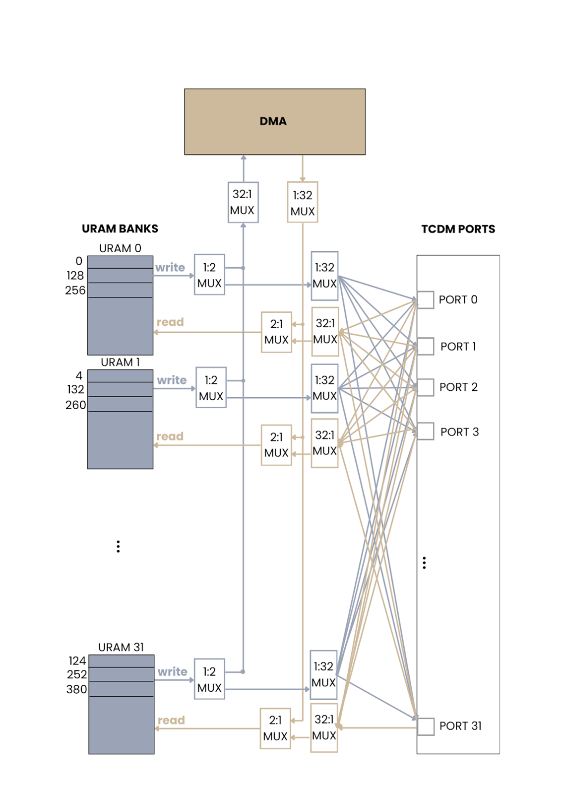

# AMD Open Hardware Competition Team AOHW25_216
AI Compilers Meet FPGAs: A HW/SW Codesign Approach for Vision Transformers

# Link to our 2 minute video: 
https://www.youtube.com/watch?v=RXjw670piBA

---

### Table of Contents
- [Note](#note)
- [Summary of Changes](#summary-of-changes)
- [FPGA System Architecture](#fpga-system-architecture)
- [Getting Started: Running the Full FPGA System](#getting-started-running-the-full-fpga-system)
  - [Requirements](#requirements)
  - [Setup and Simulation Flow](#setup-and-simulation-flow)
  - [Verifying the Results](#verifying-the-results)
- [Contributors](#contributors) 
- [Original README Content](#original-readme-content)
- [Contributors](#contributors)
- [License](#license)
- [References](#references)

---

# Note
This project is a fork of the excellent [ITA](https://github.com/pulp-platform/ita) by Gamze İslamoğlu (gislamoglu@iis.ee.ethz.ch) and Philip Wiese (wiesep@iis.ee.ethz.ch). We have ported the original ASIC-targeted accelerator core to an FPGA platform, building a custom memory subsystem and the necessary control logic to manage the full inference dataflow. Our sincere thanks go to the original creators for their foundational work.

### Summary of Changes

This fork adapts the original accelerator, which was designed for an ASIC, to a fully functional FPGA implementation. Our primary contributions were to refactor the core for FPGA synthesis and build the entire surrounding memory and control infrastructure required to run a complete inference pipeline.

The key architectural changes are:

*   **Core Refactoring for FPGA Synthesis**
    *   The original ASIC-optimized ITA core was modified to be FPGA-friendly. This involved replacing all latch-based memory elements with synthesizable flip-flops and removing the non-synthesizable clock-gating infrastructure. The core computational logic remains the same.

*   **New Memory Subsystem (ITA-URAM-DMA Adapter)**
    *   We replaced the original design's dependency on a 32-port Tightly-Coupled Data Memory (TCDM) with a custom memory controller built for FPGAs. This new adapter is the central hub of the memory system and is responsible for:
        *   **Emulating the TCDM:** It uses 32 parallel on-chip URAM banks to provide the high-bandwidth memory access required by the ITA core.
        *   **Memory Interleaving:** It maps sequential addresses across the URAM banks, allowing a single wide request from the ITA to be serviced in parallel.
        *   **Adding a DMA Interface:** It introduces a streaming interface for efficient, bulk data transfers to and from external memory (e.g., DDR), which is essential for loading model weights and input data.
        *   **Arbitration:** It manages access to the URAMs, granting control to either the ITA core during computation or the DMA during data transfers.

*   **Holistic Control and Dataflow Logic**
    *   A multi-level control system was created from scratch to manage the entire end-to-end inference process.
        *   **Top-Level FSM:** Orchestrates the high-level sequence: initiating DMA transfers to load data, triggering the ITA core for computation, and initiating DMA transfers to write back results.
        *   **Sequencer Module:** Acts as a low-level driver for the ITA core. It translates high-level commands (e.g., "compute Q matrix") into the series of precise register writes needed to process each data tile.
        *   **DMA Address Generator:** A dedicated helper module that generates the correct address streams for the memory controller during bulk DMA transfers.

---

## FPGA System Architecture

Below are diagrams of the top-level system and the memory controller we designed.

### Overall System Architecture
*This diagram shows the ITA core integrated with our custom control FSM, sequencer, DMA address generator, and the ITA-URAM-DMA Adapter, forming a complete inference pipeline.*



### ITA-URAM-DMA Adapter
*This diagram illustrates the internal logic of our memory controller, including the 32 URAM banks, the arbitration MUX, and the crossbar for routing memory requests.*



---
## Getting Started: Running the Full FPGA System

This guide will walk you through setting up the Vivado project and running a simulation of our complete FPGA system. The goal is to verify the end-to-end functionality, from loading data via a streaming interface to computing with the ITA core and streaming the results back out.

### Requirements
- Vivado 2023.1 or a compatible version.
- A Python environment with the packages from `requirements.txt` installed. You can set this up by following the instructions in the original documentation under the "Test Vector Generation" section.

### Setup and Simulation Flow

The process involves three main stages: generating test data, parameterizing the hardware, and running the simulation.

#### Step 1: Generate Test Vectors
Our testbench reads input data (weights, queries, keys, etc.) and golden results from files. You must first generate these files using the original authors' `PyITA` scripts.

1.  Navigate to the `PyITA` directory.
2.  Run the test generator script. The parameters you choose (e.g., `-S` for sequence length) define the dimensions of the Transformer attention layer being tested.
    ```bash
    # Example for generating test vectors for a sequence length of 64:
    python testGenerator.py -H 1 -S 64 -E 128 -P 192 -F 256 --no-bias --activation=identity
    ```
    *   This command will create the necessary stimuli and golden reference files in the `simvectors` directory. The hardware you configure in the next step must be able to support the dimensions you select here.

#### Step 2: Create the Vivado Project
We provide a Tcl script that automates the creation of the Vivado project, setting up all the necessary files and IP.

1.  From the root directory of the repository, run the following command in your terminal:
    ```bash
    # This will create a 'vivado_prj' directory containing the project
    vivado -mode batch -source setup_vivado.tcl
    ```
2.  **Optional - Hardware Parameterization:**
    *   If you wish to change the level of parallelism in the hardware, you can edit the `setup_vivado.tcl` file before running the command.
    *   Locate the `ITA_N` parameter. This value defines **the number of parallel processing engines** in the accelerator.
    *   The script uses a default value 8, but you can change it to explore different hardware configurations (e.g., setting it to `16`).

#### Step 3: Run the System Simulation
1.  Open Vivado and use "Open Project" to open the project located in the newly created `vivado_prj` directory.
2.  In the "Sources" panel on the left, expand the "Simulation Sources" hierarchy.
3.  To run the primary system simulation, right-click on **`tb_ITA_FPGA_WRAPPER.sv`** and select **"Set as Top"**.
4.  Click the **"Run Simulation"** button in the Flow Navigator pane.

This testbench instantiates our complete FPGA wrapper. In the simulation, you can observe the entire inference process: input data is streamed into the on-chip memories, the main controller triggers the ITA core for computation, and the final results are streamed back out. This is the recommended testbench for verifying end-to-end functionality.

### Verifying the Results

The primary goal of the simulation is to confirm that our hardware produces bit-accurate results.

The `tb_ITA_FPGA_WRAPPER.sv` testbench is designed to write the final output matrix from the hardware into a file within the simulation directory. You can then compare this output file against the "golden" reference files that were created by the Python `testGenerator.py` script in Step 1.

A successful run is one where the hardware's output perfectly matches the golden reference file, confirming the correctness of our design.

---
## Contributors

#### Original Authors (ITA Core)
- **Gamze İslamoğlu** ([gislamoglu@iis.ee.ethz.ch](mailto:gislamoglu@iis.ee.ethz.ch))
- **Philip Wiese** ([wiesep@iis.ee.ethz.ch](mailto:wiesep@iis.ee.ethz.ch))

#### FPGA Adaptation and System Integration (Team AOHW25_216)
- **Ipek Akdeniz** (Technical University of Munich) - [ipek.akdeniz@tum.de](mailto:ipek.akdeniz@tum.de)
- **Osman Yaşar** (Technical University of Munich) - [osman.yasar@tum.de](mailto:osman.yasar@tum.de)
- **Agustin Coppari Hollmann** (Technical University of Munich) - [agustin.coppari-hollmann@tum.de](mailto:agustin.coppari-hollmann@tum.de)
- **Michael Lobis** (Technical University of Munich) - [michael.lobis@tum.de](mailto:michael.lobis@tum.de)

---
## Original README Content

<details>
<summary><b>Click to expand the original documentation for the standalone ITA core</b></summary>

# Integer Transformer Accelerator
The Integer Transformer Accelerator is a hardware accelerator for the Multi-Head Attention (MHA) operation in the Transformer model.
It targets  efficient inference on embedded systems by exploiting 8-bit quantization and an innovative softmax implementation that operates exclusively on integer values.
By computing on-the-fly in streaming mode, our softmax implementation minimizes data movement and energy consumption.
ITA achieves competitive energy efficiency with respect to state-of-the-art transformer accelerators with 16.9 TOPS/W, while outperforming them in area efficiency with 5.93 TOPS/mm2 in 22 nm fully-depleted silicon-on-insulator technology at 0.8 V.

This repository contains the RTL code and test generator for the ITA.

## Structure
The repository is structured as follows:

- `modelsim` contains Makefiles and scripts to run the simulation in ModelSim.
- `PyITA` contains the test generator for the ITA.
- `src` contains the RTL code.
    * `tb` contains the testbenches for the ITA modules.

## Vivado setup

1. Source your Vivado License (in our case we used 2023.1)
2. Clone ITA
3. Get all the files and checkouts using Bender.
4. Get the python test files using the PyITA as intended by the original authors. Make sure to specify ITA_N parameter while generating the data.
5. Adjust the value of the ITA_N parameter accordingly inside setup_vivado.tcl
6. Run the following command to setup the project:
```bash
vivado -mode batch -source setup_vivado.tcl
```
6. Run simulation.

## RTL Simulation
We use [Bender](https://github.com/pulp-platform/bender) to generate our simulation scripts. Make sure you have Bender installed, or install it in the ITA repository with:
```bash
$> make bender
```

To run the RTL simulation, execute the following command:
```sh
$> make sim
$> s=64 e=128 p=192 make sim # To use different dimensions
$> target=sim_ita_hwpe_tb make sim # To run ITA with HWPE wrapper
```

## Vivado Synthesis
While running synthesis, add the following flag to synthesis settings:
```sh
$> -mode out_of_context
```

## Test Vector Generation
The test generator creates ONNX graphs and in case of MHA (Multi-Head Attention), additional test vectors for RTL simulations. The relevant files for ITA are located in the `PyITA` directory.

## Tests
In `tests` directory, several tests are available to verify the correctness of the ITA. To run the example test, execute the following command:
```sh
$> ./tests/run.sh
```

To run a series of tests, execute the following command:
```sh
$> ./tests/run_loop.sh
```

Test granularity and stalling can be set with the following commands before running the script:
```sh
$> export granularity=64
$> export no_stalls=1
```

#### Requirements
To install the required Python packages, create a virtual environment. Make sure to first deactivate any existing virtual environment or conda/mamba environment. Then, create a new virtual environment and install the required packages:

```sh
$> python -m venv venv
$> source venv/bin/activate
$> pip install -r requirements.txt
```

If you want to enable pre-commit hooks, which perform code formatting and linting, run the following command:
```sh
$> pre-commit install
```

In case you want to compare the softmax implementation with the QuantLib implementation, you need to install the QuantLib library and additional dependencies. To do so, create a virtual environment:

```sh
$> pip install torch torchvision scipy pandas
```
and install QuantLib from [GitHub](https://github.com/pulp-platform/quantlib).

```sh
$> git clone git@github.com:pulp-platform/quantlib.git
```

#### ITA Multi-Head Attention
To get an overview of possible options run:
```sh
$> python testGenerator.py -h
```

To generate a ONNX graph and test vectors for RTL simulations for a MHA operation run:
```sh
$> python testGenerator.py -H 1 -S 64 -E 128 -P 192 -F 256 --no-bias --activation=identity
```

To visualize the ONNX graph after generation, run:
```sh
$> netron simvectors/data_S64_E128_P192_H1_B1/network.onnx
```

## Contributors
- **Gamze İslamoğlu** ([gislamoglu@iis.ee.ethz.ch](mailto:gislamoglu@iis.ee.ethz.ch))
- **Philip Wiese** ([wiesep@iis.ee.ethz.ch](mailto:wiesep@iis.ee.ethz.ch))

## License
This repository makes use of two licenses:
- for all *software*: Apache License Version 2.0
- for all *hardware*: Solderpad Hardware License Version 0.51

For further information have a look at the license files: `LICENSE.hw`, `LICENSE.sw`

## References
<details>
<summary><i>ITA: An Energy-Efficient Attention and Softmax Accelerator for Quantized Transformers</i></summary>
<p>

```
@INPROCEEDINGS{10244348,
  author={Islamoglu, Gamze and Scherer, Moritz and Paulin, Gianna and Fischer, Tim and Jung, Victor J.B. and Garofalo, Angelo and Benini, Luca},
  booktitle={2023 IEEE/ACM International Symposium on Low Power Electronics and Design (ISLPED)},
  title={ITA: An Energy-Efficient Attention and Softmax Accelerator for Quantized Transformers},
  year={2023},
  volume={},
  number={},
  pages={1-6},
  keywords={Quantization (signal);Embedded systems;Power demand;Computational modeling;Silicon-on-insulator;Parallel processing;Transformers;neural network accelerators;transformers;attention;softmax},
  doi={10.1109/ISLPED58423.2023.10244348}}
```
This paper was published on [IEEE Xplore](https://ieeexplore.ieee.org/document/10244348) and is also available on [arXiv:2307.03493 [cs.AR]](https://arxiv.org/abs/2307.03493).

</p>
</details>
